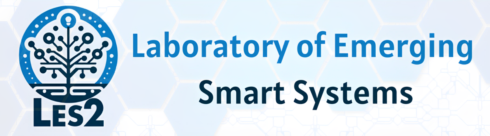

# YOLO26 Track Edge Benchmark

Benchmarks YOLO26 + ByteTrack tracking accuracy and throughput across model variants (n/s/m/l/x) and input resolutions on edge hardware. Experiments run from a single set of Jupyter notebooks, with per-device behaviour controlled by YAML profiles in `edge/profiles/`.

## Repository layout

```
data/           MOT17 sequences (not tracked — download separately)
edge/
  profiles/      YAML device profiles
  setup/        Per-device and per-toolchain setup guides
  export/       Model export scripts (Hailo, TensorRT, NCNN, QNN) + calibration
  custom/       Standalone profiling utilities (remote power, DUT worker)
  power_log.py  TC66C USB power-meter CLI logger
models/         Model weights (.pt / .hef / .engine / .onnx — not tracked)
notebooks/      00 setup · 01 profiling · 02 resolution · 04 power · 07 temporal
results/        CSV benchmark outputs (tracked) · figures (not tracked)
src/benchmark/  Python package (editable install)
```

---

## Prerequisites (all devices)

### 1 — Dataset

Download MOT17 and place the sequences under `data/`:

```
data/MOT17/train/MOT17-02/
data/MOT17/train/MOT17-04/
data/MOT17/train/MOT17-09/
```

### 2 — Python environment

```bash
python3 -m venv .venv
source .venv/bin/activate
pip install -r requirements.txt
pip install -e .
```

> Requires Python ≥ 3.12 on the development machine. Edge devices use device-specific environments described below.

---

## Running the notebooks

All experiment notebooks read a single environment variable to select the active device profile:

```bash
DEVICE_PROFILE=edge/profiles/<profile>.yaml jupyter lab
```

If `DEVICE_PROFILE` is unset, the notebooks fall back to a desktop profile (full resolution set, CUDA if available, `.pt` weights).

Notebook order:

| Notebook | Purpose |
|---|---|
| `00_setup_verify.ipynb` | Verify environment, model load, and data paths |
| `01_experiment1_profiling.ipynb` | Latency and memory across model variants |
| `02_experiment2_resolution.ipynb` | Tracking metrics vs. input resolution |
| `04_power_profiling.ipynb` | Power consumption profiling (TC66C) |
| `07_device_temporal_degradation.ipynb` | Temporal degradation across devices |

Run `00` first on every new device to confirm the environment before starting the timed experiments.

---

## Accessing JupyterLab on a remote device

JupyterLab runs on the device but is accessed from your development machine via **SSH port forwarding**. This is the most reliable approach — no firewall changes, no IP configuration.

**Step 1 — On the device**, start JupyterLab from the project root:

```bash
ssh-copy-id <user>@<device-ip>  # Do this once to set up passwordless SSH
cd /path/to/yolo26-track-edge-benchmark
DEVICE_PROFILE=$(pwd)/edge/profiles/<profile>.yaml \
  jupyter lab --no-browser -ip=0.0.0.0 --port=8888
```

_Using `$(pwd)/...` produces an absolute path, which avoids resolution errors when JupyterLab changes the working directory internally._

Copy the token from the output (looks like `?token=abc123...`).

**Step 2** — Open `http://<hostname>:8888` in your browser and paste the token. You can also click the URL in the terminal output if your SSH client supports it.

To keep the notebook running after you close your laptop or shutdown yout computer, start JupyterLab inside `tmux` or `screen` on the device before opening the tunnel.

```bash
# On the device — start a persistent session
tmux new -s bench
DEVICE_PROFILE=$(pwd)/edge/profiles/<profile>.yaml jupyter lab --no-browser --port=8888
# Detach with Ctrl-B D; reattach later with: tmux attach -t bench
```

---

## Cross-device reproducibility

All devices pin `ultralytics==8.4.19` — NMS/post-processing logic differs between versions. All models originate from the same `.pt` weights, exported per-backend to preserve numerical equivalence at the detection-head level.

| Device | Backend | Model format | Compute |
|---|---|---|---|
| Desktop | PyTorch CUDA / CPU | `.pt` | GPU or CPU (auto) |
| RPi 5 + Hailo-8L | HailoRT | `.hef` | Hailo-8L 13 TOPS |
| RPi 5 (CPU) | NCNN | `ncnn_model` | Cortex-A76 NEON |
| RPi 4 | NCNN | `ncnn_model` | Cortex-A72 NEON |
| Jetson Nano | PyTorch CUDA FP32 | `.pt` | Maxwell sm_53 |
| Jetson Nano TRT | TensorRT HQ FP16 | `.engine` | Maxwell sm_53 |
| Arduino Uno Q | NCNN | `ncnn_model` | Cortex-A53 NEON |

---

## Device profiles

### Desktop / development machine

No profile needed — the notebooks auto-detect CUDA and use `.pt` weights.

```bash
jupyter lab
```

---

### Raspberry Pi 5 + Hailo-8L M.2 Hat

**Profile:** `edge/profiles/rpi5_hailo.yaml`
**Backend:** Hailo-8L (13 TOPS) via HailoRT
**Models:** `.hef` (compiled offline, see [HEF export](#hef-export-for-hailo-8l))

#### Setup on the Pi

```bash
# Install system dependencies
sudo apt update
sudo apt install -y python3-venv git

# Clone repo and create environment
git clone <repo-url> && cd yolo26-track-edge-benchmark
python3 -m venv .venv && source .venv/bin/activate
pip install -r requirements.txt
pip install -e .

# Install HailoRT Python bindings (requires the .deb from Hailo Developer Zone)
# https://developer.hailo.ai → Software Downloads → HailoRT → Raspberry Pi
sudo dpkg -i hailort_<version>_arm64.deb
pip install hailort-<version>-cp311-cp311-linux_aarch64.whl

# Copy HEF models from development machine
rsync -avP user@devmachine:path/to/models/*.hef models/
```

> **Note:** The HEF files are available in the `models/` directory and tracked with LFS. If you modify the models or want to export new ones, follow the [HEF export instructions](#hef-export-for-hailo-8l) below.

#### Run

```bash
source .venv/bin/activate
DEVICE_PROFILE=$(pwd)/edge/profiles/rpi5_hailo.yaml jupyter lab --ip=0.0.0.0 --no-browser --port=8888
```

---

### Raspberry Pi 5 — CPU only

**Profile:** `edge/profiles/rpi5_cpu.yaml`
**Backend:** NCNN (Cortex-A76 NEON, 8 GB LPDDR4X)
**Models:** `ncnn_model`

#### Setup on the Pi

```bash
git clone <repo-url> && cd yolo26-track-edge-benchmark
python3 -m venv .venv && source .venv/bin/activate
pip install -r requirements.txt
pip install -e .

# Copy model weights
rsync -avP user@devmachine:path/to/models/*.pt models/
```

#### Run

```bash
source .venv/bin/activate
DEVICE_PROFILE=$(pwd)/edge/profiles/rpi5_cpu.yaml jupyter lab --no-browser --ip=0.0.0.0 --port=8888
```

---

### Raspberry Pi 4

**Profile:** `edge/profiles/rpi4.yaml`
**Backend:** NCNN (Cortex-A72 NEON, 4 GB LPDDR4)
**Models:** `ncnn_model`
**Setup guide:** [`edge/setup/MiniForge_SETUP.md`](edge/setup/MiniForge_SETUP.md)

The RPi 4 uses Cortex-A72 (ARMv8.0-A), which lacks the ARMv8.2-A instructions in modern PyPI wheels. The setup guide uses Miniforge (Conda) with pinned PyTorch and NumPy versions compiled for broader ARM compatibility.


```bash
DEVICE_PROFILE=$(pwd)/edge/profiles/rpi4.yaml jupyter lab --no-browser --ip=0.0.0.0 --port=8888
```

---

### Jetson Nano (JetPack 4.x)

**Setup guide:** [`edge/setup/JetsonNano_SETUP.md`](edge/setup/JetsonNano_SETUP.md)

JetPack 4.6.x ships CUDA 10.2 and TensorRT 8.2 on the Maxwell GPU (128 cores, sm_53, 4 GB shared). Two profiles are available:

| Profile | Backend | Model format | Precision |
|---|---|---|---|
| `edge/profiles/jetson_nano.yaml` | PyTorch CUDA | `.pt` | FP32 |
| `edge/profiles/jetson_nano_trt.yaml` | TensorRT HQ | `.engine` | FP16 |

The TensorRT HQ pipeline uses graph-surgery to cut the ONNX model at the 6 detection-head Conv outputs, bypassing the post-processing ops that TRT 8.2 compiles incorrectly on Maxwell. Post-processing (anchor decode, NMS) runs on CPU. See the setup guide for the full installation process.

#### Run

```bash
source .venv/bin/activate
# PyTorch CUDA FP32
DEVICE_PROFILE=$(pwd)/edge/profiles/jetson_nano.yaml jupyter lab \
  --ip=0.0.0.0 --no-browser --port=8888
# TensorRT HQ FP16
DEVICE_PROFILE=$(pwd)/edge/profiles/jetson_nano_trt.yaml jupyter lab \
  --ip=0.0.0.0 --no-browser --port=8888
```

> **Note:** yolo26m and above may exceed the 4 GB shared memory budget.
> The runner logs OOM failures and continues with the remaining variants.

---

### Arduino Uno Q (QRB2210)

**Profile:** `edge/profiles/arduino_uno_q.yaml`
**Backend:** NCNN (Cortex-A53 NEON, 2–4 GB LPDDR4)
**Models:** `ncnn_model`
**Setup guide:** [`edge/setup/MiniForge_SETUP.md`](edge/setup/MiniForge_SETUP.md)

#### Setup on the board

```bash
sudo apt update
sudo apt full-upgrade -y
sudo apt install -y python3 python3-venv python3-dev git

git clone <repo-url> && cd yolo26-track-edge-benchmark
python3 -m venv .venv && source .venv/bin/activate
pip install --upgrade pip
pip install -r requirements.txt
pip install -e .

# [OPTIONAL] Copy model weights from development machine if the board has no internet access
rsync -avP user@devmachine:path/to/models/*.pt models/
```

#### Run

```bash
source .venv/bin/activate
DEVICE_PROFILE=$(pwd)/edge/profiles/arduino_uno_q.yaml jupyter lab --no-browser --ip=0.0.0.0 --port=8888
```

> **Note:** yolo26n and yolo26s are expected to load; yolo26m and above will
> likely OOM on the 2 GB SKU. The runner skips gracefully and logs results for
> the variants that do load.

---

## HEF export for Hailo-8L

HEF compilation requires Ubuntu 22.04, Python 3.11, and the Hailo DFC 3.33
wheel. It runs in Docker — no native install needed.

### 1 — Place Hailo wheels

Download from [Hailo Developer Zone](https://developer.hailo.ai) and place in
`edge/hailo-wheels/`:

```
edge/hailo-wheels/hailo_dataflow_compiler-3.33.0-py3-none-linux_x86_64.whl
edge/hailo-wheels/hailort-4.23.0-cp311-cp311-linux_x86_64.whl
```

### 2 — Collect calibration images

```bash
source .venv/bin/activate
python edge/collect_calib.py --n 64
```

### 3 — Build the Docker image and run the export

```bash
docker build -f edge/Dockerfile.hailo-export -t hailo-export:3.33 .
docker compose -f edge/docker-compose.yml run --rm hailo-export
```

Output HEF files appear in `models/`. A provenance CSV is written to
`edge/export/logs/export_results.csv`.

---

## Retrieving results

After running on a device, copy the result CSVs back to the development
machine:

```bash
rsync -avP pi@raspberrypi.local:~/yolo26-track-edge-benchmark/results/raw/ results/raw/
```

Result filenames include the `result_tag` from the device profile
(e.g. `MOT17-04_yolo26n.hef_640_rpi5_hailo.csv`), so outputs from
different devices can coexist in the same `results/raw/` directory without
collision.

Run the analysis notebooks on the development machine to generate
combined figures across all devices.
